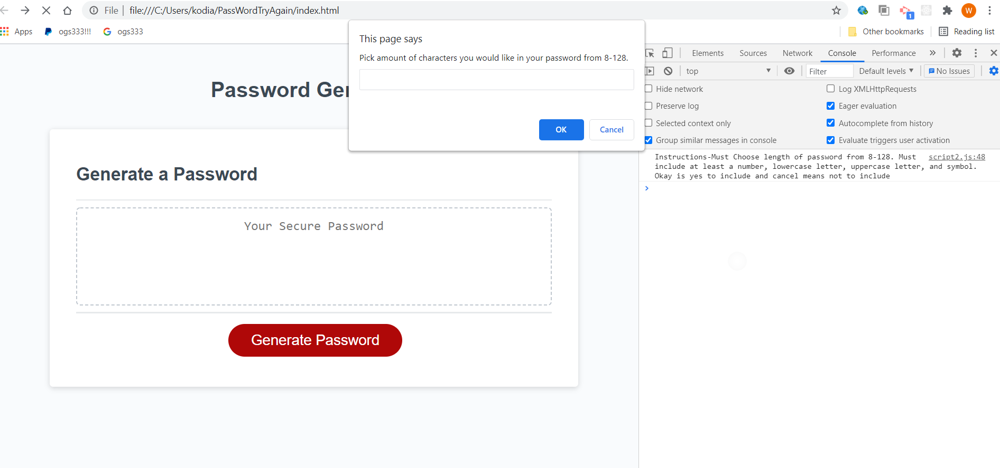

# Password Generator
by Jennifer Detmering

## Description
This is basic Javascript password generator program. It generates a new password once the user chooses the length and whether or not to include Uppercase letters, lowercase letters, numbers, and/or special characters.

## Deployment

## Project Image

## Technologies 
For this project I used Visual Studio Code, HTML, CSS, and Javascript.

## Challenges
1/10/2021-first started this project using a different javascript method. 
1/14/2021-noticed I did assignment differently than everyone else and started to wonder if I should start over
1/19/2021-Created the HTML, CSS, Javascript, and README files to redo this assignment. 
1/20/2021-Developing the code 
1/28/2021-made a random general number and letter generator in the console, mapping out user choices,
getting ready to apply alerts, prompts, confirms
1/29/2021-was able to get working though the length and prompts matching up with values. Was able to push this info into a 
password array for temp.

## Contributors 
https://stackoverflow.com/questions/10952615/how-can-i-find-the-length-of-a-number