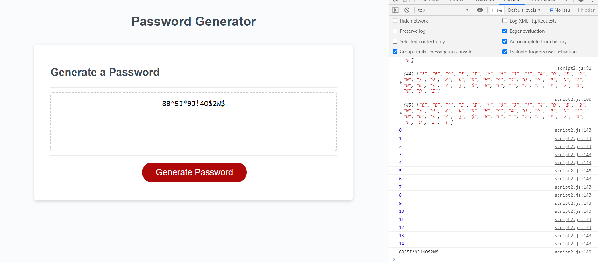

# Password Generator

by Jennifer Detmering

#### []

## Table of Contents

1. [Installation](#installation)
2. [Usage](#usage)
3. [Technologies Used](#technologies_used)
4. [Credits](#credits)
5. [License](#license)
6. [Features](#features)
7. [Questions and Contributions](#questions_and_contributions)
8. [Tests](#tests)

## Description

This is basic Javascript password generator program. It generates a new password once the user chooses the length and whether or not to include Uppercase letters, lowercase letters, numbers, and/or special characters.

## Deployment

## https://kodiakshuksan.github.io/PassWordTryAgain/

## Installation

## Technologies

For this project I used Visual Studio Code, HTML, CSS, and Javascript.

## Challenges

1/10/2021-first started this project using a different javascript method.
1/14/2021-noticed I did assignment differently than everyone else and started to wonder if I should start over
1/19/2021-Created the HTML, CSS, Javascript, and README files to redo this assignment.
1/20/2021-Developing the code
1/28/2021-made a random general number and letter generator in the console, mapping out user choices,
getting ready to apply alerts, prompts, confirms
1/29/2021-was able to get working though the length and prompts matching up with values. Was able to push this info into a
password array for temp.
5/24/2021-Finally got the included array to be the length of designated password

## Credits-

[w3 schools](https://w3schools.com)

## License-

### [License: MIT](https://opensource.org/licenses/MIT)

## Features-

Uses Google API Books to search for books and save them to a reading wish list.

## Questions and Contributions-

### GitHub Profile: https://github.com/kodiakshuksan

### Email: kodiakshuksan@yahoo.com

## Tests-

none
